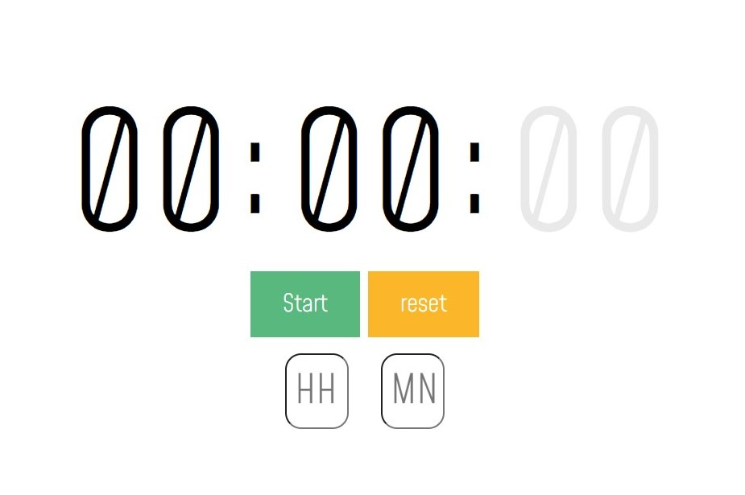

<h1>chronometer</h1>

<strong>This is a stopWatch with an option to modificate values</strong> 
<a href="https://damienlopvet.github.io/chronometer/>"</a>
<h2> Scenario </h2>

Sometimes you want to know how long you have been working. 
<strong>Using a stopWatch </strong>can be tricky because when you forget to stop it when you're done, it keep on running !! 
I looked for a stopWatch that you can <strong>update</strong>.  
  And didn't find it. 
I needed a specific stopWatch to time my weekly work  
  with this nice option to update the hours or minutes values
  <strong>so i create it !</strong>
<h3><a href="https://damienlopvet.github.io/chronometer/">Here it is</a></h3>
